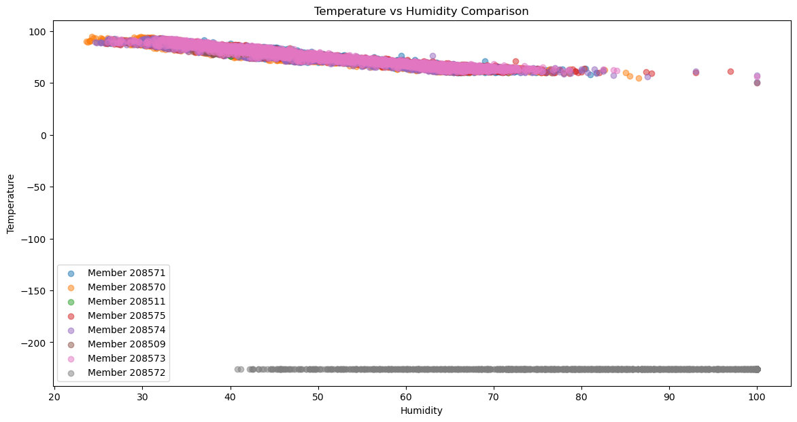

[Home](/README.md)
## ⋆˙⟡ Welcome to Rosemary's Blog !⟡˙⋆

## A little about my page:
I started this REU on 05.21.2024
Throughout my time here my goal is to update every 1-2 days and share my progess, setbacks, and thoughts that i've had along the way. 

## May 21st - May 24th
My first day was on Tuesday May 21st and my first tasks were:
1. Set up Anaconda Python
2. Set up Visual Studio Code
3. Have our GitHub ready for use
4. Document my steps for my teammate arriving later on
5. Read _Connor's Thesis_ to get a better idea and understand what the goals of the research project are
6. Familiarize myself with Pandas to make data analysis easier later down the road

After I had my environment setup, I spent time understanding the raw data connor had collected for his thesis and looking through his code to further understand his work. 

## May 28st - May 31th
The second week we decided I was prepared to focus on our sensors!!

##### Purple Air:
Our team started by making two API keys (read & write) with Purple air. We then set up our first two sensors in our workplace on the second floor of Sprauge to test out data collection, using the new API, and overall just practice working with them. 

Later on this week we met Professor Hawkins and she had introduced us to the rest of the sensors Connor used for his thesis. We created a group to track all of them at once
**At this point we had 8 Purple Air sensors** 
* HMC Jacobs 1
* HMC Jacobs 2
* HMC Jacobs 3
* HMC Jacobs 4
* HMC Jacobs 5
* HMC Jacobs 6
* Sprauge: floor 2
* SpragueFloor2

Check out the sensors on the map!--> **https://map.purpleair.com/1/mAQI/a10/p604800/cC0#16.9/34.105133/-117.712128**

To make sure they were working we decided to test their collection by making a simple plot showing how humidity and temperature values on different sensors relate to each other. (important in Connors thesis)

From this plot we decided that one of our sensors (grey HMC Jacobs 1) was not working properly ᴖ̈ so we will not be using it for our data collection period.

##### QuantAQ:
Dominick focused on this sensor more!

